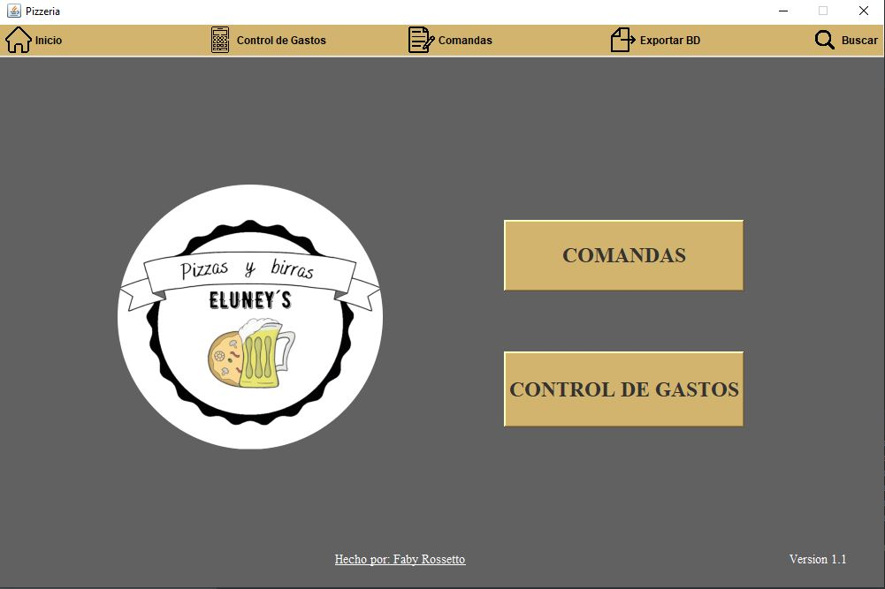

# Pizzeria Management System - "Eluney's" 🍕

### Description
This is a desktop application developed for a real-world business located in Villa Gesell,Buenos Aires, Argentina. The system was designed to streamline daily operations, including order management and financial tracking.

### 🚀 Key Features

#### 1. Order Management (Comandas)
* **Creation:** Menu selection system with dropdowns for waitstaff and order status.
* **Management:** Full CRUD functionality for existing orders.
* **Advanced Search:** Filter orders by table number, waiter name, date, or current status.

#### 2. Financial Control (Control de Gastos)
* **Purchases & Sales:** Record and track all business expenses and revenue.
* **Daily Balance:** Automated daily balance reports.
* **Data Portability:** Export database records to **Excel** and automated daily local backups.

### 🎥 Project Demos & Screenshots
* **Video Showcase:** [View Project Videos here](https://drive.google.com/drive/folders/1AiAGT13F5BaHTc-AHK8UDbnjFHa2r3PU?usp=sharing)
* 

### 🛠 Tech Stack
* **Language:** Java 17
* **Framework:** Spring Boot
* **UI/UX:** Swing / Java GUI
* **Database:** H2 (Embedded database)
* **Integration:** Excel Export API

---
### 📫 Contact
**Fabiana Rossetto:** [LinkedIn Profile](https://www.linkedin.com/in/fabyrossetto/)
